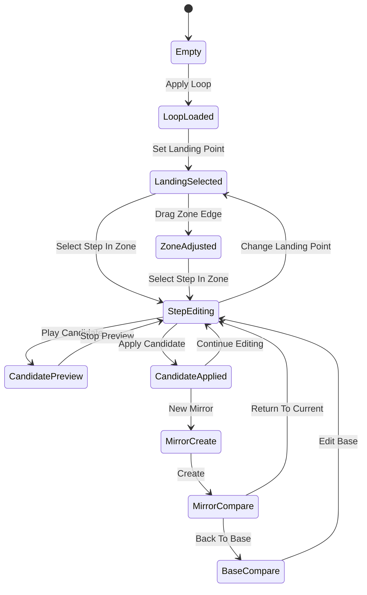
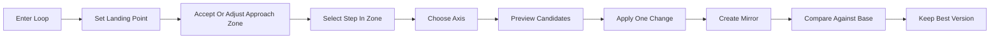

# Harmonic Orbit

首屏 wireframe 与状态流转，基于 [integrated-concept-harmonic-orbit-v2.md](C:\Users\BW\DevPlayground\ProjectMartino\integrated-concept-harmonic-orbit-v2.md)。

目标不是视觉风格稿，而是把信息层级、组件职责、操作顺序和状态切换钉死，方便直接进入低保真原型。

## 首屏原则

- 首屏只服务一个任务：围绕单一 `Landing Point` 编辑并比较 `Approach Zone`
- 不出现二级页面导航
- 不出现理论术语菜单墙
- 默认就是循环播放的工作台，不是“项目首页”

## Desktop Wireframe

```text
+--------------------------------------------------------------------------------------+
| Harmonic Orbit                                                        Loop  Click   |
| Short-loop landing path editor                                       [On]  [Off]   |
+--------------------------------------------------------------------------------------+
|                                                                                      |
|  INPUT BAR                                                                           |
|  [ Dm7 | G7 | Cmaj7 | A7                     ] [Load Demo] [Apply Loop]              |
|                                                                                      |
|  ORBIT LOOP                                         STEP INSPECTOR                   |
|                                                                                      |
|                  . . . . . . . . . . .                                               |
|             . .                         . .                                           |
|          . .        Approach Zone         . .                                         |
|        . .          [Dm7][G7]              . .                                        |
|       . .                                     . .     Step: G7                       |
|      . .            Landing: Cmaj7             . .    Role: dominant                 |
|      . .                 [Cmaj7]               . .    Axis: [Color][Pull][Link]     |
|       . .                                     . .                                     |
|        . .                                 . .       Candidates                      |
|          . .                           . .          1. Original   [Play] [Apply]    |
|             . . . . . . . . . . . . . .            2. Db7        [Play] [Apply]    |
|                                                     3. G7alt      [Play] [Apply]    |
|                                                                                      |
|                                                     Zone Controls                    |
|                                                     [Expand Left] [Shrink]          |
|                                                     [Exclude Step]                  |
|                                                                                      |
+--------------------------------------------------------------------------------------+
| MIRROR DOCK                                                                          |
| [Base] [Color: tritone] [Link: slip] [+ New Mirror]                                 |
| Hover: diff preview   Click: audition   Shift+Click: compare against base           |
+--------------------------------------------------------------------------------------+
| TRANSPORT                                                                            |
| [Play Loop] [Solo Zone] [Bypass Edits] [Back to Base] [Save Mirror]                 |
+--------------------------------------------------------------------------------------+
```

## 区域职责

### 1. Header

只保留最少的全局信息：

- 产品名：`Harmonic Orbit`
- 一句副标题：`Short-loop landing path editor`
- 两个全局切换：`Loop`、`Click`

不放：

- 工程管理
- 模式切换
- 多余导出入口

### 2. Input Bar

这是唯一的输入起点。

字段与按钮：

- 文本框占主宽度，支持简洁 chord input
- `Load Demo`
- `Apply Loop`

微文案：

- placeholder: `Enter 2-4 bars, using 2 or 4 steps per bar`
- helper text: `Examples: Dm7 | G7 | Cmaj7 | A7`

状态规则：

- 未输入时，Orbit Loop 显示 empty state
- 输入非法格式时，只在输入栏给错误，不污染主画面

### 3. Orbit Loop

这是主舞台，不是编辑表单。

它必须同时表达 4 件事：

- 整个 loop 的长度与播放位置
- 唯一 `Landing Point`
- 连续的 `Approach Zone`
- 当前被选中的 step

视觉规则：

- `Landing Point` 永远最亮
- `Approach Zone` 是连续高亮弧段
- zone 外步骤透明度下降 40%
- 当前 step 外圈有细描边

交互规则：

- 单击 step：选中 step
- 双击 step：设为 `Landing Point`
- 拖 zone 左边界：扩大或缩小 zone
- 点击 zone 外 step：只切换选中，不修改 zone

### 4. Step Inspector

Inspector 只有在选中 zone 内 step 时出现。

结构顺序固定：

1. 当前 step label
2. 自动识别角色
3. 轴切换
4. 候选列表
5. zone 调整按钮

文案固定：

- `Step`
- `Role`
- `Axis`
- `Candidates`

角色文案只允许 4 种：

- `pre-dominant`
- `dominant`
- `tonic return`
- `passing / link`

候选列表每项都包含：

- chord label
- 短标签，如 `stable`, `brighter`, `delayed`, `slippery`
- `Play`
- `Apply`

### 5. Mirror Dock

Mirror Dock 不是历史记录，而是版本比较器。

每个 mirror chip 必须包含：

- 轴标签：`Color` / `Timing` / `Link`
- 用户命名或自动命名
- 与 base 的差异数量标记，例如 `1 diff`

操作：

- `Hover`：暂时预听，不切换主状态
- `Click`：切换当前版本
- `Shift+Click`：base 与该 mirror 来回对比
- `+ New Mirror`：从当前状态创建新 mirror

创建 mirror 时弹出一个很小的 inline sheet：

- `Choose axis`
- `Name this version`
- `[Create]`

### 6. Transport

Transport 只放会影响试听判断的动作：

- `Play Loop`
- `Solo Zone`
- `Bypass Edits`
- `Back to Base`
- `Save Mirror`

禁止放：

- tempo map
- mixer
- export stems

## 首屏状态

首屏至少要覆盖 5 个状态。

### A. Empty State

Orbit Loop 中间显示：

- 标题：`Start with a short loop`
- 说明：`Enter 2-4 bars to shape how the music lands`
- 次按钮：`Load Demo`

Inspector 与 Mirror Dock disabled。

### B. Loop Loaded

出现完整环轨，但还没有 `Landing Point`。

Orbit Loop 内部提示：

- `Double-click a step to set the landing point`

Inspector 仍隐藏。

### C. Landing Selected

用户已经选定 `Landing Point`，系统建议 `Approach Zone`。

界面变化：

- 环上出现亮色落点
- 左侧连续弧段高亮
- Inspector 打开，但先显示：
  - `Step not selected`
  - `Pick a step inside the approach zone`

### D. Step Editing

用户选中了 zone 内 step。

界面变化：

- Inspector 显示角色、轴和候选
- 候选支持试听与应用
- zone 调整按钮激活

### E. Mirror Compare

至少存在一个 mirror。

界面变化：

- Dock 内出现 base 与 mirrors
- 当前版本高亮
- Orbit Loop 用颜色或尾迹显示当前版本与 base 的差异

## 关键微文案

这些文案应固定，避免原型阶段反复漂移。

### 输入阶段

- `Enter 2-4 bars, using 2 or 4 steps per bar`
- `Load Demo`
- `Apply Loop`

### 落点阶段

- `Double-click a step to set the landing point`
- `Landing point set`
- `Suggested approach zone`

### 编辑阶段

- `Pick a step inside the approach zone`
- `Role detected: dominant`
- `Choose one axis before comparing versions`

### 候选阶段

- `Original`
- `Apply to current step`
- `Preview before applying`

### 镜面阶段

- `Create mirror from current version`
- `This mirror can only edit one axis`
- `Back to base`

## 组件状态流转



## 用户状态流



## 交互硬规则

- 没有 `Landing Point` 时，不允许创建 mirror
- 没有选中 zone 内 step 时，不显示候选
- 每次只能展开一个 Inspector
- 当前版本不是 `base` 时，`Back to Base` 必须始终可见
- 创建 mirror 时必须先选轴，不能跳过
- 当前在 mirror 上编辑时，页面顶部必须显示 `Editing: Color mirror` 这类状态提示

## 最低保真原型验收

如果做第一版 wireframe prototype，至少应该能演示这 7 件事：

1. 输入 demo loop 并生成环轨
2. 双击设置落点
3. 调整 zone 边界
4. 选中 dominant step
5. 在 `Color` 轴中试听 3 个候选
6. 创建一个 `Color` mirror
7. 在 `base` 和 mirror 间来回切换

如果这 7 步不能在 1-2 分钟 demo 里顺畅演完，说明 wireframe 还不够清楚。

## 下一步

在这份 wireframe 之后，最自然的下一层不是视觉风格，而是：

- 做一版 `desktop low-fi screen set`
- 补一份 `candidate generation rules table`
- 再决定是否需要 mobile companion，而不是直接做 responsive 主版本
